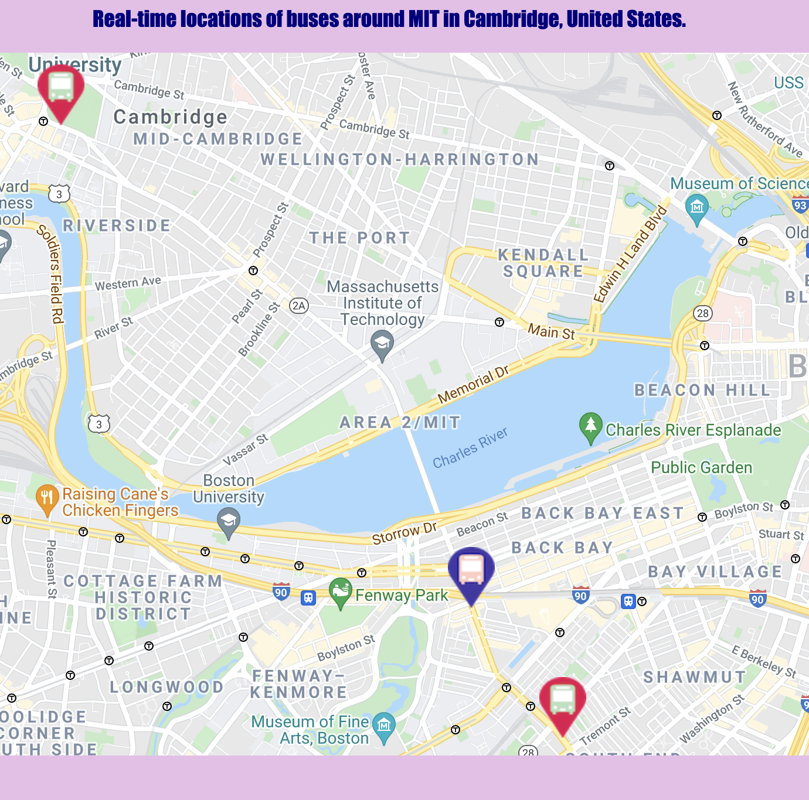

# bus-tracker 🚌

## Working with DOM in JavaScript

The goal is to demonstate real-time locations of buses around Massachusetts Institute of Technology (MIT) which we will be using the Massachusetts Bay Transportation Authority (MBTA) bus data and adding animated markers on the map to highlight the bus routes.

 

<a href="https://anyapages.github.io/bus_tracker.html">Interactive version</a>

